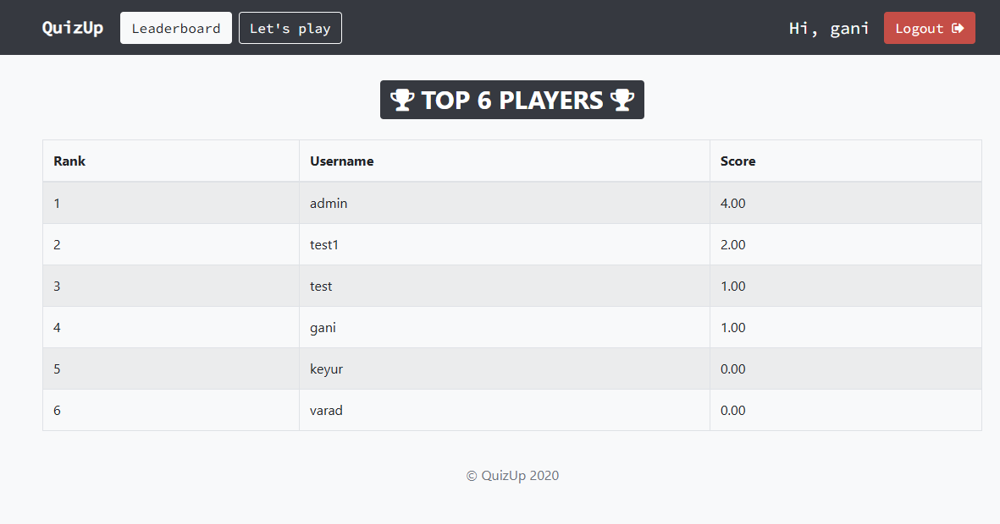

# Quiz-App  --  Django based quiz website


 

[](https://github.com/ganeshsriprasad/Quiz-App/commits/main)
[](http://badges.mit-license.org)

----
## Features 📋

### ⚡️. User Authentication:
Login/Signup: Users can create accounts and log in to participate in quizzes and view their scores.
Session Management: Each user has a unique session to track progress and results.

### ⚡️. Quiz Creation and Management:
Quiz Models: Quizzes are stored in the database, typically with fields like title, description, category (e.g., programming, algorithms), and a set of questions.
Question Models: Each quiz has multiple questions, which include the question text, options, and correct answers.

### ⚡️. Quiz Interface:
Quiz-taking page: A simple, interactive interface to take quizzes where users answer multiple-choice or text-based questions.
Answer Submission: After answering a question, users can move to the next one, and upon completion, they get a summary of their results.

### ⚡️. Technical Quizzes:
Categories and Difficulty: The quizzes can be categorized by difficulty (easy, medium, hard) or by technical topics (e.g., Python, Data Structures, Algorithms, Web Development).
Question Types: Mix of multiple-choice questions, coding challenges, and theoretical questions related to technical topics.

### ⚡️. Leaderboard:
Score Calculation: After finishing a quiz, users get a score based on the number of correct answers and possibly the time taken to complete the quiz.
Leaderboard Models: A model to track user scores for each quiz and display the top performers.
Viewing Leaderboard: A page that displays a leaderboard, showing the highest scores for each quiz, with the user’s rank and score. This could also be filtered by date or quiz type.


---
## Tech Stack:

Backend: Django (Python) for user management, quiz questions handling, and database management.

Frontend: HTML, CSS, JavaScript for the quiz app and user interface.

Database: SQLite to store user data, quiz, leaderboard info.

---

### Website Preview

#### Home Page


---

#### Authorised user page


---


#### Quiz Page


---
#### Leaderboard Page



---

## Installation 📦

### Clone the Repository

Clone this repository to your local machine using Git:

```bash
git clone https://github.com/ganeshsriprasad/Quiz-App
```

# Create and Activate a Virtual Environment
A virtual environment is recommended to isolate the project dependencies. Follow the steps below:

## Navigate to the project directory:
```shell
cd Quiz-App
```

## Create a virtual environment.
```bash
python -m venv myenv
myenv\Scripts\activate
```

Once activated, your terminal prompt will change to show the virtual environment name.
## Install Dependencies
With the virtual environment activated, install the required dependencies using pip:
```bash
pip install -r requirements.txt
```

## Dont forget migrations

```shell
python manage.py makemigrations
python manage.py migrate
```

## Run the Development Server
To start the development server, use the following command:
```bash
python -m manage runserver
```


### You can now access the website at http://127.0.0.1:8000/ in your browser.


---

## Contributing 💡


#### Step 1

- **Option 1**
    - 🍴 Fork this repo!

- **Option 2**
    - 👯 Clone this repo to your local machine.


#### Step 2

- **Build your code** 🔨🔨🔨

#### Step 3

- 🔃 Create a new pull request.


## License 📄
This project is licensed under the MIT License - see the [LICENSE.md](./LICENSE) file for details.
